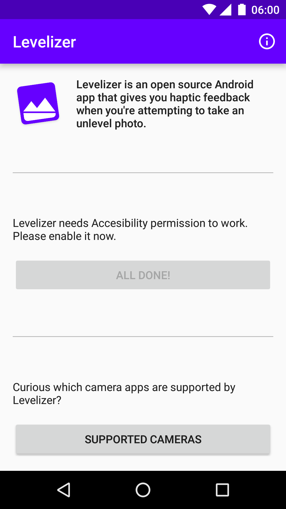
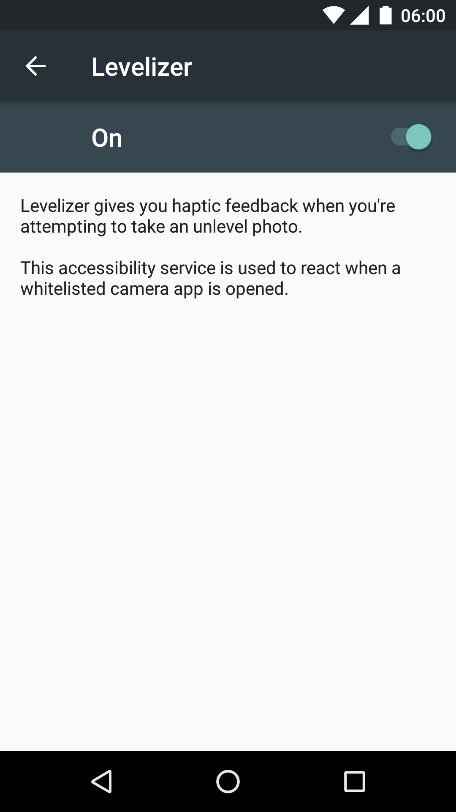

Levelizer
===========

Levelizer is an open source Android app that gives you haptic feedback when you're attempting to take an unlevel photo.

You can use your favorite camera app; Levelizer runs in the background!

The app is designed with battery life in mind.

 

## Todo

- Allow user to whitelist camera apps from a list of all apps installed
- Configuration options:
  - Vibration strength
  - Toggle notification
- Window overlay to also give a visual cue when device is level
- Audio cue when device is level

## Contributors

* [Paul Lammertsma](https://github.com/pflammertsma)
* [Martin Liersch](https://github.com/Goddchen)
* [Frank Bouwens](https://github.com/frankkienl)

## License

Licensed under the Apache license 2.0.

Google Play and the Google Play logo are trademarks of Google Inc.
